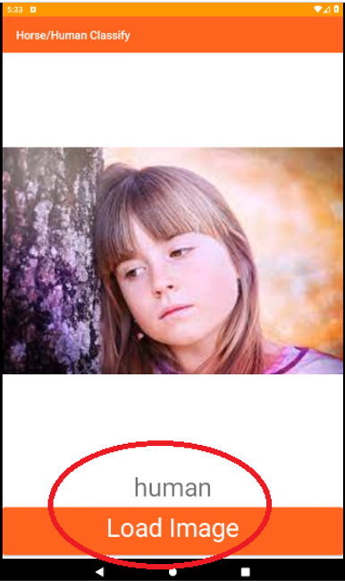

# 🐎👤 Horses or Humans Image Classifier (Android)

[](https://kotlinlang.org/)  
[](https://www.tensorflow.org/lite)  
[](https://developer.android.com/)  
[](LICENSE)  

This is an **Android application** that uses a **pre-trained machine learning model** to classify images as either **horses** or **humans**.  
Built with **Kotlin** and leveraging **TensorFlow Lite**, the app provides a simple, **offline on-device solution** for fast and private image classification.  

---

## 📖 Project Description

The application’s core functionality is an efficient deep learning model converted to the **TensorFlow Lite (TFLite)** format.  
This lightweight model is bundled within the app, enabling fast and private predictions.  

The user interface, developed in **Kotlin**, allows users to select an image from their device’s gallery and instantly displays the result — **“Horse”** or **“Human.”**

---

## ✨ Features

- **On-Device Machine Learning** – Runs entirely on-device with TFLite.  
- **Gallery Integration** – Select images directly from your phone’s gallery.  
- **Intuitive UI** – Clean and simple interface following Android best practices.  
- **Offline Functionality** – No internet required after installation.  

---

## ⚙️ Prerequisites

To build and run this project, you need:  

- **Android Studio 11.0+**  
- **Android SDK** with target API level **30+**  

---

## 🚀 Installation & Setup

### 1. Clone the Repository
```bash
git clone https://github.com/wasimnawaz1/horses_or_humans_app.git
cd horses_or_humans_app
````

### 2. Open in Android Studio

* Launch Android Studio → **Open an existing project**
* Select the `horses_or_humans_app` directory

### 3. Sync Gradle

* Android Studio will prompt to **Sync Gradle** → Click **Sync Now**

### 4. Run the App

* Connect a physical Android device via USB or start an emulator
* Click the green **Run ▶** button in Android Studio

---

## ▶️ Usage

1. **Select an Image** – Tap the button to open your phone’s photo gallery
2. **Allow Permissions** – Grant storage access when prompted
3. **Get Prediction** – Select a horse or human image, and the app displays the result

---

## 📸 Demo

### App UI Screenshot



---

## 📂 Project Structure

```
horses_or_humans_app/
├── app/
│   ├── build.gradle              # App-level Gradle file
│   └── src/
│       ├── main/
│       │   ├── java/             # Kotlin source code
│       │   │   └── com/example/horses_or_humans_app/
│       │   │       └── MainActivity.kt
│       │   ├── res/              # Resources (layouts, images, etc.)
│       │   │   ├── drawable/
│       │   │   ├── layout/
│       │   │   └── values/
│       │   └── assets/           # Directory for the TFLite model
│       │       └── model.tflite  # TensorFlow Lite model file
│       └── AndroidManifest.xml   # App manifest file
├── build.gradle                  # Project-level Gradle file
└── README.md
```

---

## 📦 Dependencies

* **TensorFlow Lite** – On-device ML inference
* **Kotlin** – App logic and UI
* **AndroidX Libraries** – Standard Jetpack components

---

## 🤝 Contributing

Contributions are welcome! 🎉
Please open an **issue** to report bugs or suggest new features, or submit a **pull request** with improvements.

---

## 📄 License

This project is licensed under the **MIT License**. See the [LICENSE](LICENSE) file for details.

```

---

Do you also want me to add a **“Model Training” section** explaining how the original CNN was trained and then converted to `.tflite`, so developers can retrain or update the model if needed?
```
